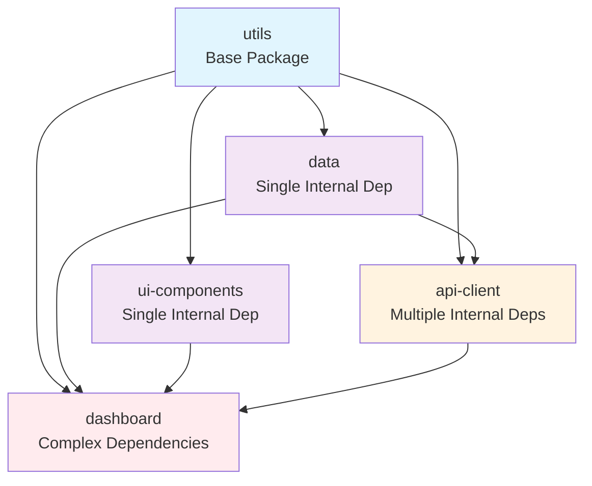

# Knot Package Templates - Inter-Package Dependencies Guide

This directory contains comprehensive examples demonstrating various inter-package dependency scenarios in Knot projects. These templates showcase best practices for structuring packages with clean dependency hierarchies.

## 📚 Package Templates Overview

### Basic Templates
- **`typescript/`** - Basic TypeScript package with no dependencies
- **`react/`** - Basic React component package with no dependencies

### Dependency Examples
- **`utils/`** - Foundation package (no internal dependencies)
- **`ui-components/`** - Single internal dependency example
- **`data/`** - Heavy external dependencies + single internal dependency
- **`api-client/`** - Multiple internal dependencies example
- **`dashboard/`** - Complex dependency chains example

## 🏗️ Dependency Architecture



## 📋 Dependency Scenarios

### 1. Base Package (`utils/`)
**Pattern**: No internal dependencies, serves as foundation
**Use Case**: Common utilities, types, validation, formatting
**Dependencies**: Only external npm packages (date-fns, lodash)

```yaml
# package.yml
internal: [] # No internal dependencies
external:
  - date-fns@^2.30.0
  - lodash@^4.17.21
```

**Key Features**:
- ✅ Validation utilities (`validateEmail`, `isStrongPassword`)
- ✅ Formatting functions (`formatCurrency`, `formatDate`) 
- ✅ Helper functions (`generateId`, `retry`, `debounce`)
- ✅ Common types (`ApiResponse`, `ValidationError`)
- ✅ Re-exported external dependencies

### 2. Single Internal Dependency (`ui-components/`, `data/`)

#### UI Components Pattern
**Pattern**: Depends only on `utils` package
**Use Case**: Reusable React components with validation and formatting

```yaml
# package.yml
internal:
  - utils # Uses validation, formatting, helpers
external:
  - clsx@^1.2.1
  - framer-motion@^10.12.16
```

**Integration Examples**:
```typescript
// Input component with utils validation
import { validators, generateId } from 'utils';

const validateInput = (value: string) => {
  return validators.validateEmail(value, 'Email');
};
```

#### Data Package Pattern  
**Pattern**: Heavy external deps + single internal dependency
**Use Case**: Database connections, caching, schemas

```yaml
# package.yml
internal:
  - utils # Uses retry, validation, helpers
external:
  - "@prisma/client@^4.15.0"
  - "zod@^3.21.4"
  - "ioredis@^5.3.2"
  - "mongodb@^5.6.0"
```

**Integration Examples**:
```typescript
// Database with utils retry logic
import { retry, generateId } from 'utils';

await retry(async () => {
  await database.connect();
}, 3, 1000);
```

### 3. Multiple Internal Dependencies (`api-client/`)
**Pattern**: Depends on both `utils` and `data` packages
**Use Case**: HTTP client with validation, types, and error handling

```yaml
# package.yml
internal:
  - utils # Validation, retry, error types
  - data  # User/Post types, schemas
external:
  - axios@^1.4.0
  - axios-retry@^3.4.0
```

**Integration Examples**:
```typescript
// Uses types from data package
import { User, Post, QueryOptions } from 'data';
// Uses validation from utils package
import { validators, ValidationError } from 'utils';

const createUser = async (userData: Partial<User>) => {
  // Utils validation
  const emailError = validators.validateEmail(userData.email);
  if (emailError) throw emailError;
  
  // Data schema validation
  const validUser = UserSchema.parse(userData);
  
  return api.post('/users', validUser);
};
```

### 4. Complex Dependency Chains (`dashboard/`)
**Pattern**: Depends on entire package ecosystem
**Use Case**: Complete dashboard with UI, data, and API integration

```yaml
# package.yml
internal:
  - utils        # Base utilities
  - data         # Types and schemas
  - ui-components # UI components
  - api-client   # API operations
external:
  - chart.js@^4.3.0
  - react-query@^3.39.0
```

**Integration Examples**:
```typescript
// UserDashboard using all packages
import { formatDate, validators } from 'utils';
import { User, QueryOptions } from 'data';
import { Button, DataTable, Input } from 'ui-components';
import { ApiClient } from 'api-client';

const UserDashboard = ({ apiClient }: { apiClient: ApiClient }) => {
  // Complex workflows leveraging all packages
  const handleUserCreate = async (userData) => {
    // 1. Utils validation
    const errors = validators.validateUser(userData);
    if (errors.length) return;
    
    // 2. API client operation (which uses data types)
    const user = await apiClient.createUser(userData);
    
    // 3. UI components for display
    // 4. Utils formatting for dates/currency
  };
};
```

## 🚀 Getting Started

### 1. Create a Basic Package
```bash
knot create package my-utils --template typescript
```

### 2. Create Package with Dependencies
```bash
# Create UI components package (depends on utils)
knot create package my-components --template ui-components

# Create API client package (depends on utils + data)  
knot create package my-api --template api-client
```

### 3. Understanding package.yml
Each template includes a `package.yml` that defines:

```yaml
name: "{{name}}"           # Package name (templated)
description: "{{description}}" # Package description (templated)
version: "{{version}}"     # Package version (templated)
dependencies:
  external:                # npm dependencies
    - "axios@^1.4.0"
  internal:                # knot package dependencies  
    - utils
    - data
scripts:                   # Package scripts
  build: "tsc"
  test: "jest"
```

## 📊 Dependency Guidelines

### ✅ Best Practices

#### 1. Clear Hierarchy
```
Base Layer (utils) → Single Deps (data, ui-components) → Multi Deps (api-client) → Complex (dashboard)
```

#### 2. Avoid Circular Dependencies
```typescript
// ❌ Bad: Circular dependency
// utils imports from api-client
// api-client imports from utils

// ✅ Good: One-way dependency
// api-client imports from utils
// utils has no knowledge of api-client
```

#### 3. Selective Imports
```typescript
// ✅ Good: Import specific functions
import { formatCurrency, validateEmail } from 'utils';

// ❌ Bad: Import everything
import * as utils from 'utils';
```

#### 4. Consistent Error Types
```typescript
// ✅ Good: Use utils ValidationError across all packages
import { ValidationError } from 'utils';

const validate = (): ValidationError[] => {
  // Return consistent error format
};
```

### ⚠️ Anti-Patterns to Avoid

#### 1. Circular Dependencies
```typescript
// ❌ utils/index.ts
import { User } from 'data'; // Creates circular dependency

// ❌ data/index.ts  
import { formatters } from 'utils';
```

#### 2. Deep Dependency Chains
```typescript
// ❌ Avoid chains longer than 4 levels
A → B → C → D → E → F // Too deep, hard to maintain
```

#### 3. Duplicate Functionality
```typescript
// ❌ Don't reimplement utils functions
const formatCurrency = (amount) => {
  // Reimplementing utils.formatCurrency
};

// ✅ Use existing utils functions
import { formatCurrency } from 'utils';
```

## 🧪 Testing Strategies

### Unit Testing with Mocks
```typescript
// Mock dependencies for isolated testing
jest.mock('utils', () => ({
  formatCurrency: jest.fn(),
  validators: { validateEmail: jest.fn() }
}));

jest.mock('api-client', () => ({
  ApiClient: jest.fn().mockImplementation(() => ({
    getUsers: jest.fn()
  }))
}));
```

### Integration Testing
```typescript
// Test actual package integration
import { UserDashboard } from 'dashboard';
import { ApiClient } from 'api-client';

test('dashboard integrates with api-client', async () => {
  const apiClient = new ApiClient(testConfig);
  render(<UserDashboard apiClient={apiClient} />);
  // Test actual integration
});
```

## 📦 Bundle Size Optimization

### Tree Shaking
```typescript
// ✅ Good: Specific imports enable tree shaking
import { formatCurrency } from 'utils';

// ❌ Bad: Imports entire package
import utils from 'utils';
const price = utils.formatCurrency(29.99);
```

### Code Splitting
```typescript
// Split complex packages at component level
const Dashboard = lazy(() => import('dashboard').then(m => ({
  default: m.Dashboard
})));
```

## 🔍 Debugging Dependencies

### Dependency Analysis
```bash
# View package dependency tree
knot deps --tree

# Check for circular dependencies
knot deps --check-circular

# Analyze bundle size impact
knot build --analyze
```

### Common Issues

#### 1. Version Conflicts
```bash
# Check for version mismatches
knot deps --check-versions
```

#### 2. Missing Dependencies
```bash
# Verify all dependencies are installed
knot install --verify
```

#### 3. Circular Dependencies
```bash
# Find circular dependency chains
knot deps --find-circular
```

## 📚 Learn More

- **[Basic TypeScript Package](./typescript/README.md)** - Starting point
- **[Utils Package](./utils/README.md)** - Foundation patterns  
- **[UI Components](./ui-components/README.md)** - Single dependency example
- **[Data Package](./data/README.md)** - External + internal dependencies
- **[API Client](./api-client/README.md)** - Multiple internal dependencies
- **[Dashboard Package](./dashboard/README.md)** - Complex dependency chains

These examples demonstrate real-world patterns for building maintainable, scalable package architectures in Knot projects. Start with the simpler examples and work your way up to more complex dependency scenarios.