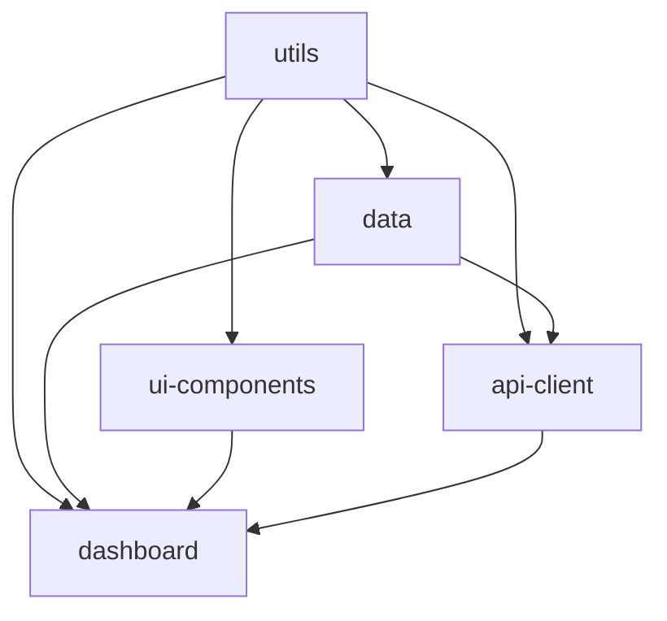

# Dashboard Package

An advanced UI package demonstrating **complex dependency chains**. This package depends on `utils`, `data`, `ui-components`, and `api-client`, showcasing how to build sophisticated applications by composing multiple packages.

## Overview

The `dashboard` package provides complete dashboard interfaces with data visualization, real-time updates, and complex user interactions. It demonstrates the full power of inter-package dependencies by leveraging functionality from the entire package ecosystem.

## Dependency Chain Position

```
utils (base package)
 ↑
data (depends on utils)
 ↑
ui-components (depends on utils)
 ↑
api-client (depends on utils + data)
 ↑
dashboard (depends on utils + data + ui-components + api-client)
 ↑
└── Applications can use complete dashboard functionality
```

## Complete Dependency Graph



## Installation & Usage

```bash
# The package.yml automatically resolves the entire dependency tree
knot add dashboard
```

```typescript
import { 
  Dashboard, 
  UserDashboard, 
  PostDashboard,
  AnalyticsDashboard 
} from 'dashboard';
```

## Cross-Package Integration

### 1. Utils Package Usage
- **ID Generation** - Unique component IDs using `generateId()`
- **Formatting** - Display data using `formatters` (currency, dates, numbers)
- **Validation** - Form validation using `validators`
- **Helpers** - Data manipulation using `debounce`, `cloneDeep`, etc.

### 2. Data Package Usage
- **Types** - User, Post, QueryOptions for type safety
- **Schemas** - Zod validation for forms and API responses
- **Cache** - Optional caching integration for performance

### 3. UI Components Usage
- **Base Components** - Button, Input, DataTable for consistent UI
- **Form Handling** - Pre-validated inputs and forms
- **Data Display** - Tables with built-in formatting and sorting

### 4. API Client Usage
- **Data Fetching** - Type-safe API operations
- **Error Handling** - Consistent error display and retry logic
- **Real-time Updates** - WebSocket or polling integration

## Dashboard Components

### 1. User Dashboard
Complete user management interface with real-time data.

```typescript
import { UserDashboard } from 'dashboard';
import { ApiClient } from 'api-client';

const apiClient = new ApiClient(config);

<UserDashboard
  apiClient={apiClient}
  onUserSelect={(user) => navigate(`/users/${user.id}`)}
  onUserCreate={() => navigate('/users/new')}
  onUserEdit={(user) => navigate(`/users/${user.id}/edit`)}
  onUserDelete={(user) => confirmDelete(user)}
/>
```

**Cross-Package Integration:**
- Uses `Button`, `Input`, `DataTable` from ui-components
- Uses `User` types and `QueryOptions` from data package  
- Uses `ApiClient` operations for CRUD functionality
- Uses `formatters` for data display (dates, status)
- Uses `validators` for search input validation

### 2. Analytics Dashboard
Data visualization dashboard with charts and KPIs.

```typescript
import { AnalyticsDashboard } from 'dashboard';

<AnalyticsDashboard
  apiClient={apiClient}
  dateRange={{ from: startDate, to: endDate }}
  refreshInterval={30000}
  onExport={(format) => exportData(format)}
/>
```

**Features:**
- Real-time KPI cards with formatted numbers
- Interactive charts using Chart.js
- Data export functionality
- Automatic refresh with loading states

### 3. Post Dashboard
Content management dashboard with advanced filtering.

```typescript
import { PostDashboard } from 'dashboard';

<PostDashboard
  apiClient={apiClient}
  filters={{
    published: true,
    dateRange: { from: lastWeek, to: today }
  }}
  onPostEdit={(post) => openEditor(post)}
  onPostPublish={(post) => publishPost(post)}
/>
```

**Advanced Features:**
- Virtual scrolling for large datasets
- Bulk operations (publish, delete, archive)
- Advanced search with multiple filters
- Drag-and-drop reordering

## Real-World Usage Example

### Complete Dashboard Application
```typescript
import React, { useState } from 'react';
import { QueryClient, QueryClientProvider } from 'react-query';
// All dashboard components with their dependencies
import { 
  Dashboard, 
  UserDashboard, 
  PostDashboard,
  AnalyticsDashboard 
} from 'dashboard';
import { ApiClient } from 'api-client';

// API client configuration using types from multiple packages
const apiClient = new ApiClient({
  baseURL: process.env.REACT_APP_API_URL,
  authConfig: {
    type: 'bearer',
    token: localStorage.getItem('auth_token')
  },
  retryConfig: {
    retries: 3,
    retryDelay: 1000
  }
});

const queryClient = new QueryClient();

function App() {
  const [activeTab, setActiveTab] = useState('users');

  return (
    <QueryClientProvider client={queryClient}>
      <div className="min-h-screen bg-gray-50">
        <nav className="bg-white shadow">
          {/* Navigation using ui-components */}
        </nav>
        
        <main className="max-w-7xl mx-auto py-6 px-4">
          {activeTab === 'users' && (
            <UserDashboard
              apiClient={apiClient}
              onUserSelect={(user) => {
                // Uses formatters from utils for logging
                console.log(`Selected user: ${user.name} (${formatDate(user.createdAt)})`);
              }}
            />
          )}
          
          {activeTab === 'posts' && (
            <PostDashboard
              apiClient={apiClient}
              onPostPublish={async (post) => {
                try {
                  await apiClient.publishPost(post.id);
                  queryClient.invalidateQueries('posts');
                } catch (error) {
                  // Error handling using utils types
                  if (error.validation) {
                    showValidationErrors(error.validation);
                  }
                }
              }}
            />
          )}
          
          {activeTab === 'analytics' && (
            <AnalyticsDashboard
              apiClient={apiClient}
              refreshInterval={30000}
            />
          )}
        </main>
      </div>
    </QueryClientProvider>
  );
}
```

## Data Flow Example

Here's how data flows through the dependency chain:

```typescript
// 1. User clicks "Create User" button (ui-components)
const handleCreateUser = async (userData) => {
  try {
    // 2. Validate using utils package
    const emailError = validators.validateEmail(userData.email);
    if (emailError) throw new Error(emailError.message);
    
    // 3. Validate using data package schema
    const validUser = UserSchema.parse(userData);
    
    // 4. Create via API client
    const response = await apiClient.createUser(validUser);
    
    // 5. Update UI with formatted response
    const formattedUser = {
      ...response.data,
      createdAt: formatDate(response.data.createdAt, 'PPP')
    };
    
    // 6. Show in DataTable component
    updateUsersList(formattedUser);
    
  } catch (error) {
    // 7. Display error using consistent error types
    if (error.validation) {
      showValidationErrors(error.validation);
    }
  }
};
```

## Performance Optimizations

### 1. Code Splitting
```typescript
import { lazy } from 'react';

// Lazy load dashboard components to reduce bundle size
const UserDashboard = lazy(() => import('dashboard').then(m => ({ 
  default: m.UserDashboard 
})));
```

### 2. Data Caching
```typescript
// Leverage data package caching
const cache = new Cache({
  provider: 'memory',
  ttl: 300 // 5 minutes
});

// Cache frequently accessed data
const getCachedUsers = async () => {
  const cached = await cache.get('users');
  if (cached) return cached;
  
  const users = await apiClient.getUsers();
  await cache.set('users', users);
  return users;
};
```

### 3. Virtual Scrolling
```typescript
import { useVirtual } from '@tanstack/react-virtual';

// Handle large datasets efficiently
const VirtualizedUserList = ({ users }) => {
  const rowVirtualizer = useVirtual({
    size: users.length,
    parentRef: parentRef,
  });
  
  // Render only visible items
};
```

## Testing Strategy

### 1. Unit Testing
```typescript
// Mock all package dependencies
jest.mock('utils', () => ({
  formatDate: jest.fn(),
  validators: { validateEmail: jest.fn() }
}));

jest.mock('ui-components', () => ({
  Button: 'button',
  DataTable: 'div'
}));

jest.mock('api-client', () => ({
  ApiClient: jest.fn().mockImplementation(() => ({
    getUsers: jest.fn(),
    createUser: jest.fn()
  }))
}));
```

### 2. Integration Testing
```typescript
// Test complete workflows across packages
test('user creation workflow', async () => {
  // 1. Render dashboard
  render(<UserDashboard apiClient={mockApiClient} />);
  
  // 2. Click create button (ui-components)
  fireEvent.click(screen.getByText('Create User'));
  
  // 3. Fill form with validation (utils)
  fireEvent.change(screen.getByLabelText('Email'), {
    target: { value: 'test@example.com' }
  });
  
  // 4. Submit and verify API call (api-client)
  fireEvent.click(screen.getByText('Save'));
  expect(mockApiClient.createUser).toHaveBeenCalled();
});
```

## Best Practices

### ✅ Do
- Import specific functions to optimize bundle size
- Use React Query for data fetching and caching
- Implement proper loading and error states
- Leverage all package capabilities instead of duplicating logic
- Use virtual scrolling for large datasets

### ❌ Don't  
- Import entire packages when you only need specific functions
- Bypass validation layers for performance
- Create tightly coupled components
- Ignore error boundaries
- Duplicate functionality that exists in dependencies

## Bundle Size Considerations

The dashboard package is the heaviest in the dependency tree. Monitor bundle size:

```bash
# Analyze bundle composition
npx webpack-bundle-analyzer dist/static/js/*.js

# Check tree-shaking effectiveness
knot build --analyze
```

## Deployment

### Production Optimizations
```typescript
// Lazy load heavy dashboard components
const DashboardRoutes = lazy(() => import('./DashboardRoutes'));

// Preload critical data
const preloadDashboardData = async () => {
  await Promise.all([
    apiClient.getUsers({ limit: 10 }),
    apiClient.getPosts({ limit: 5 })
  ]);
};
```

This package demonstrates the culmination of inter-package dependency architecture, showing how multiple focused packages can be composed to create sophisticated, maintainable applications with excellent developer experience and performance characteristics.